# Weekly nerds

### Sketchnotes met Maaike van Cruchten en Brit Wijnmaalen

Notes

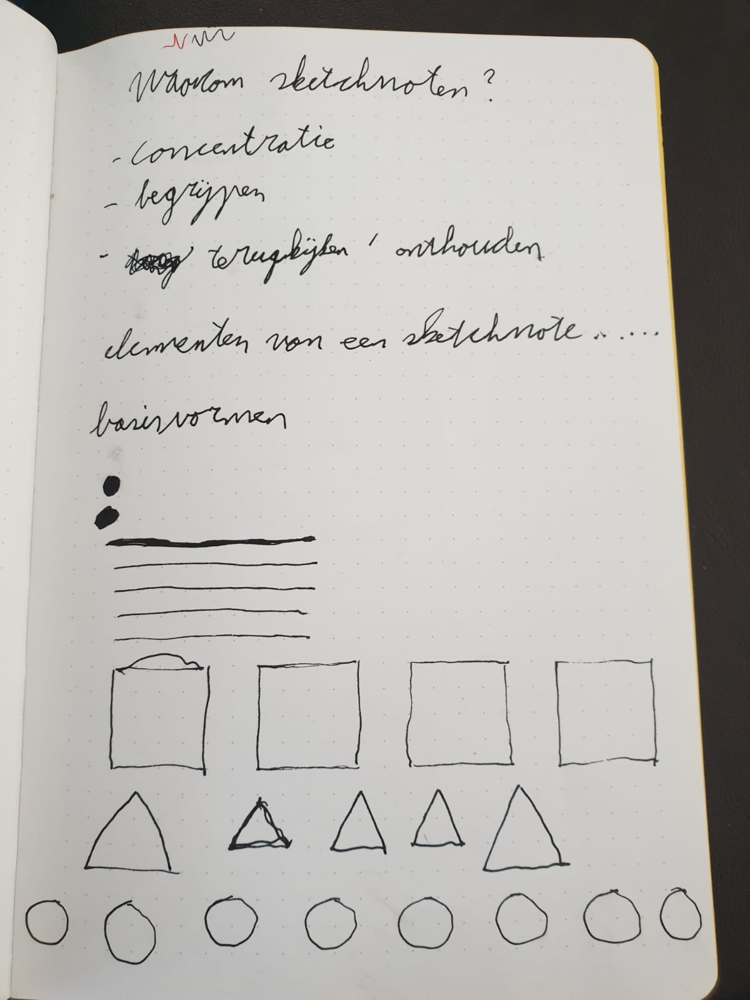

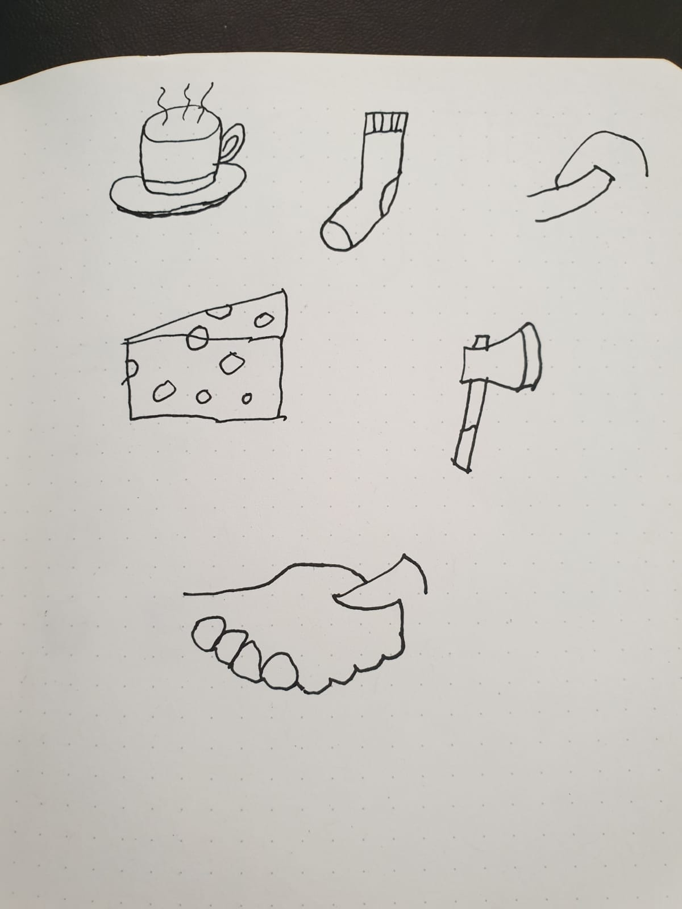

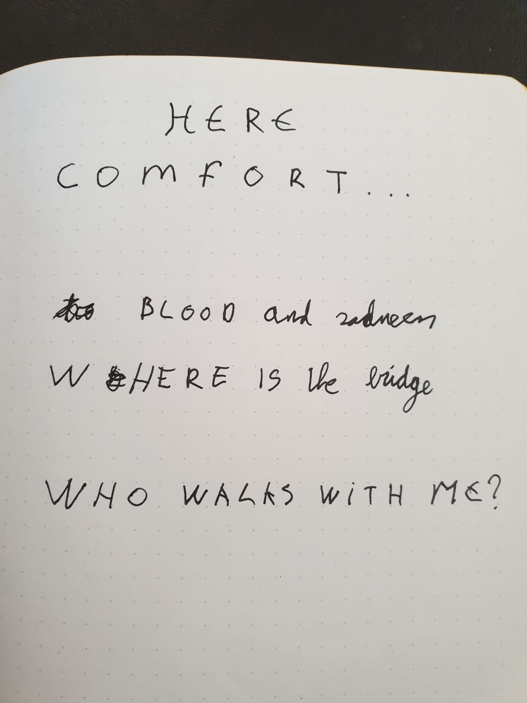

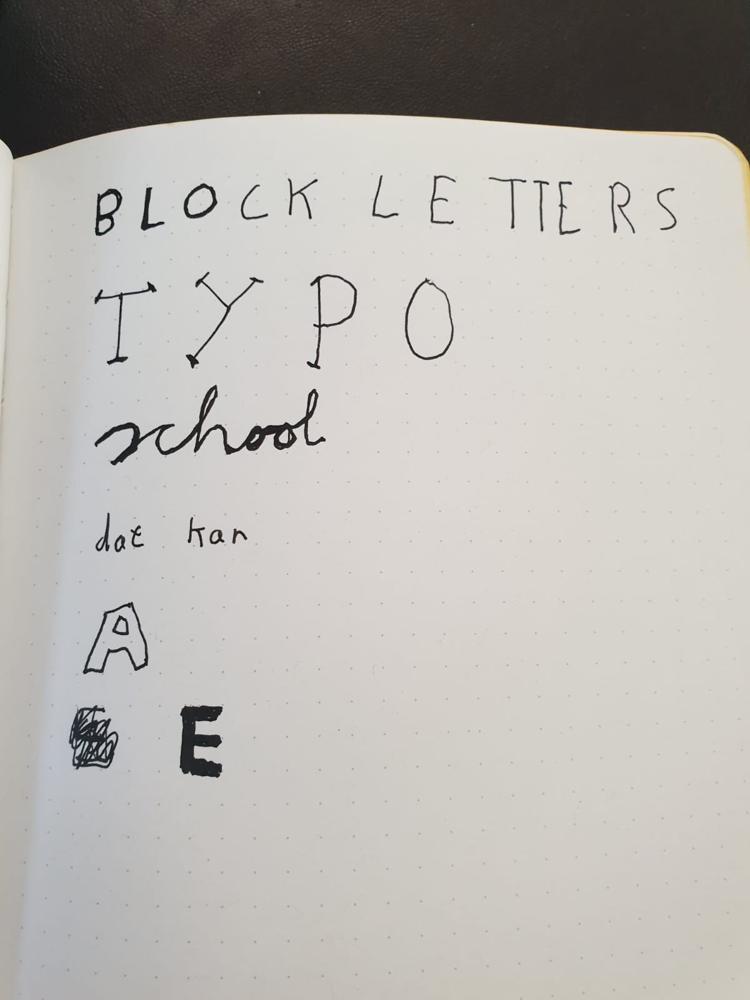

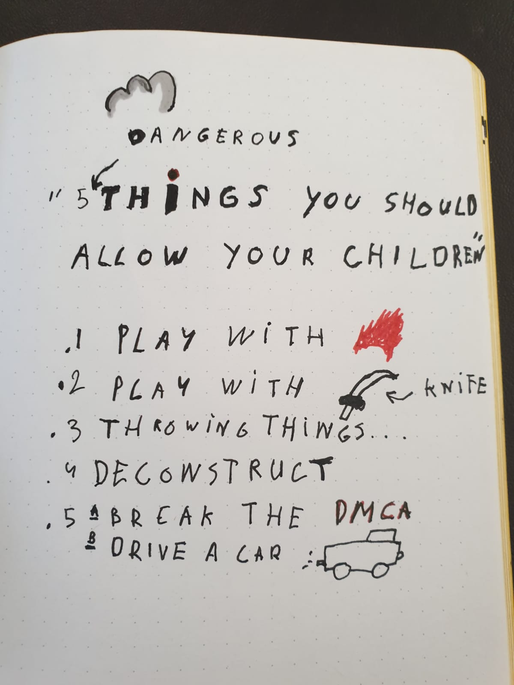

### Stephan Hay over Design Patterns

Notes

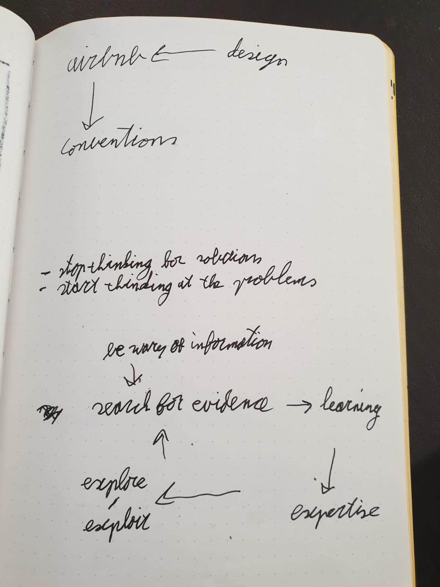

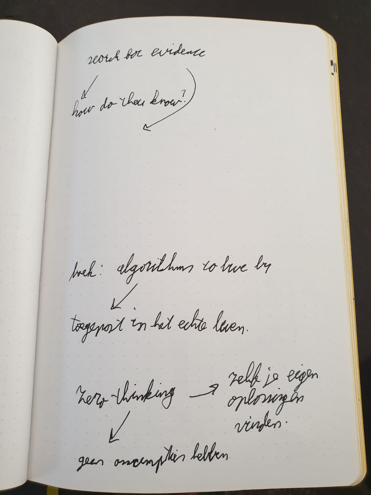

### Cyd Stumpel (ex) & Dennis Spierenburg (ex) over werken als Frontender bij Matise

Notes

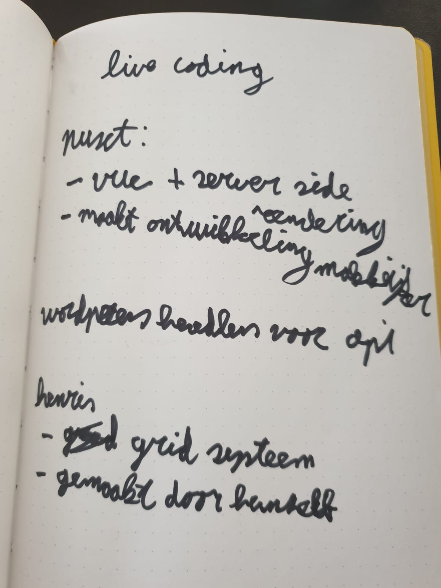

### Maike Klip over ontwerpen voor vluchtelingen

Notes

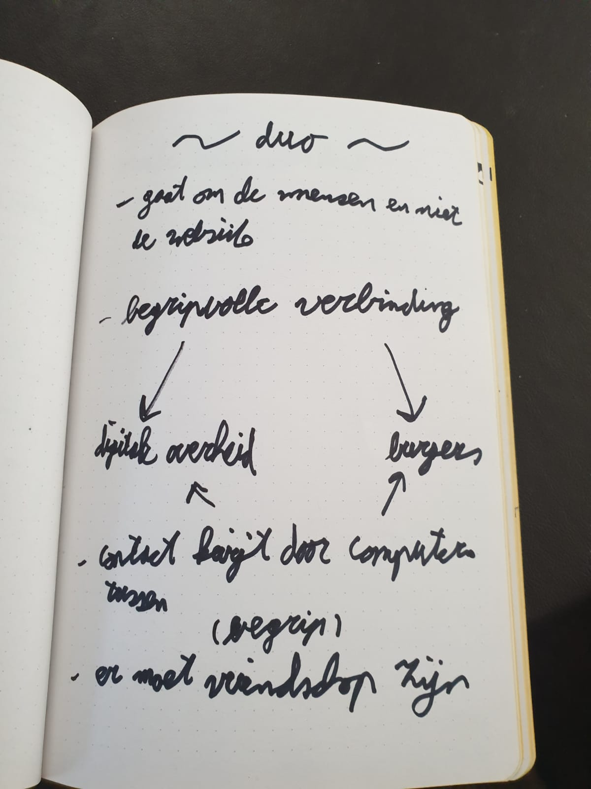

### Ischa Gast over A11y

Notes

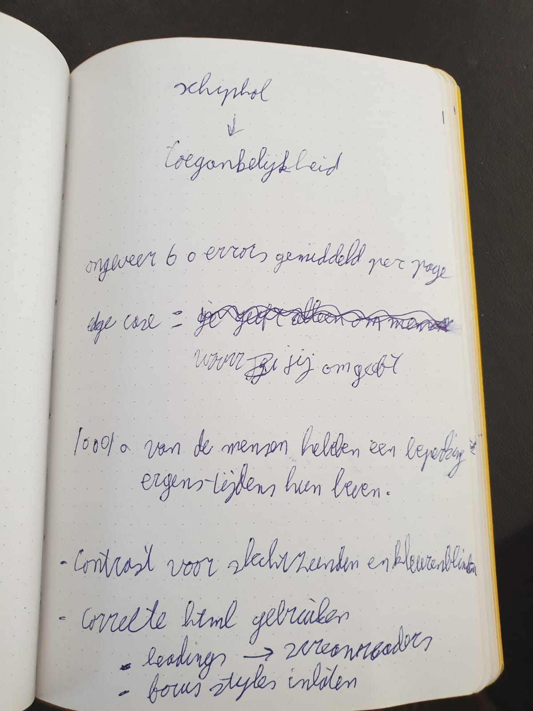

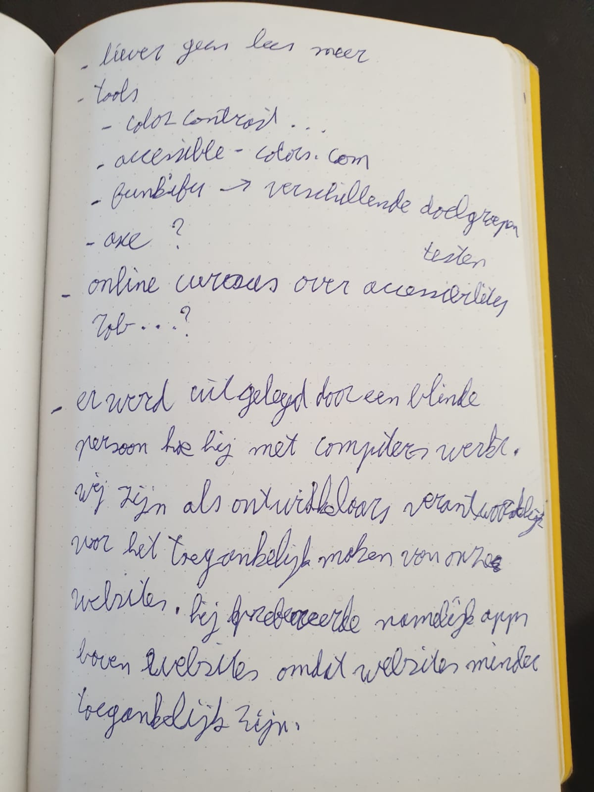

### Workshop PE

Notes

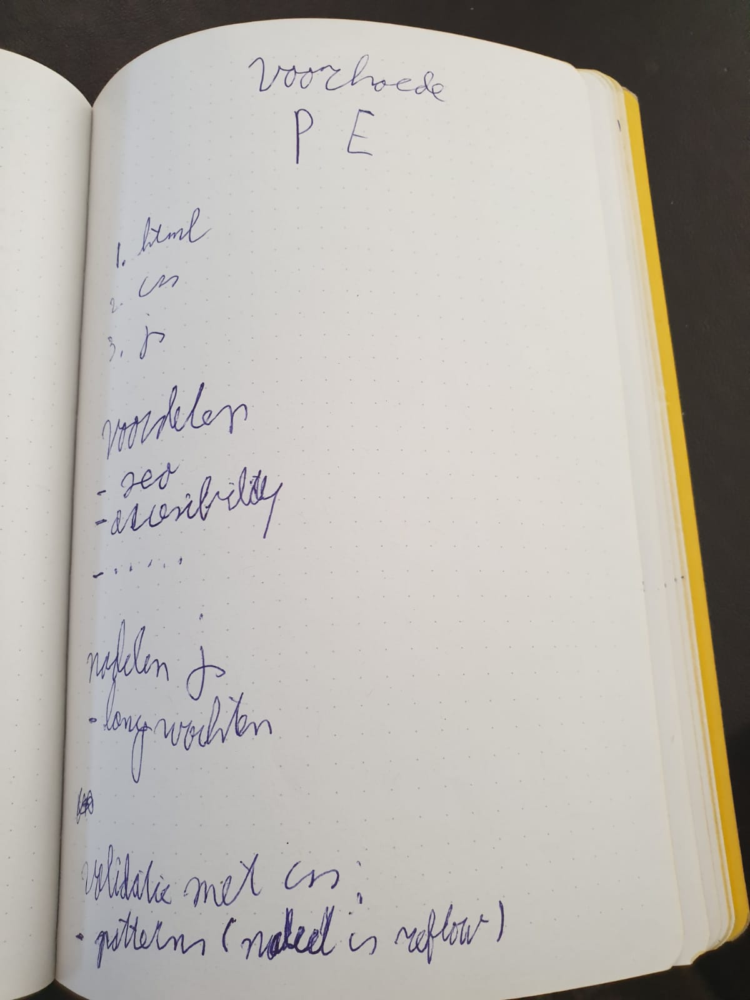

### Daan Rongen over afstuderen en je eigen signatuur behouden

Notes

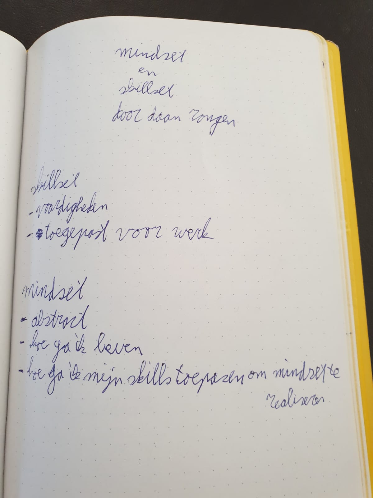

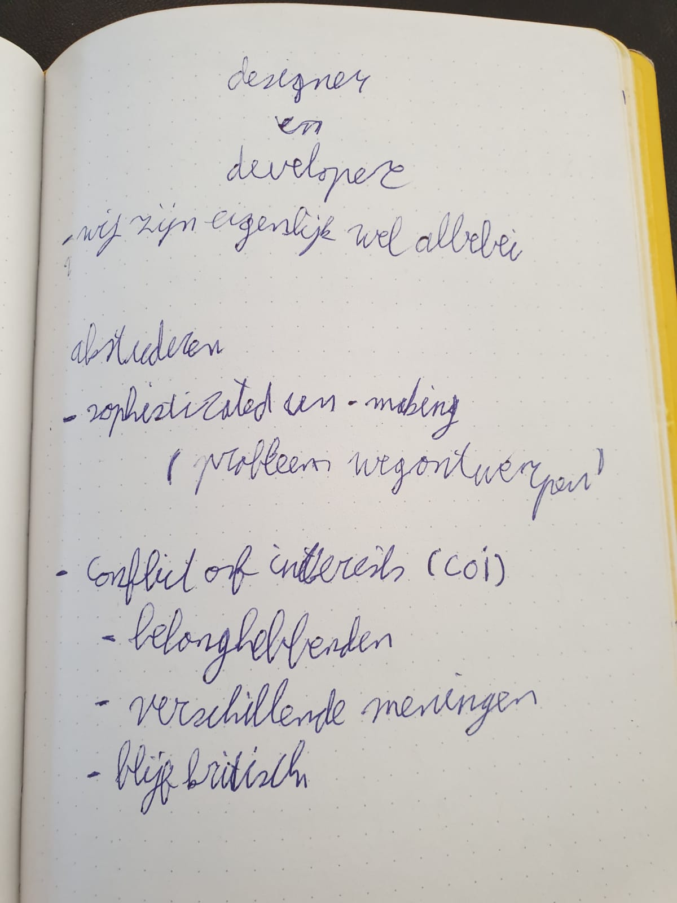

